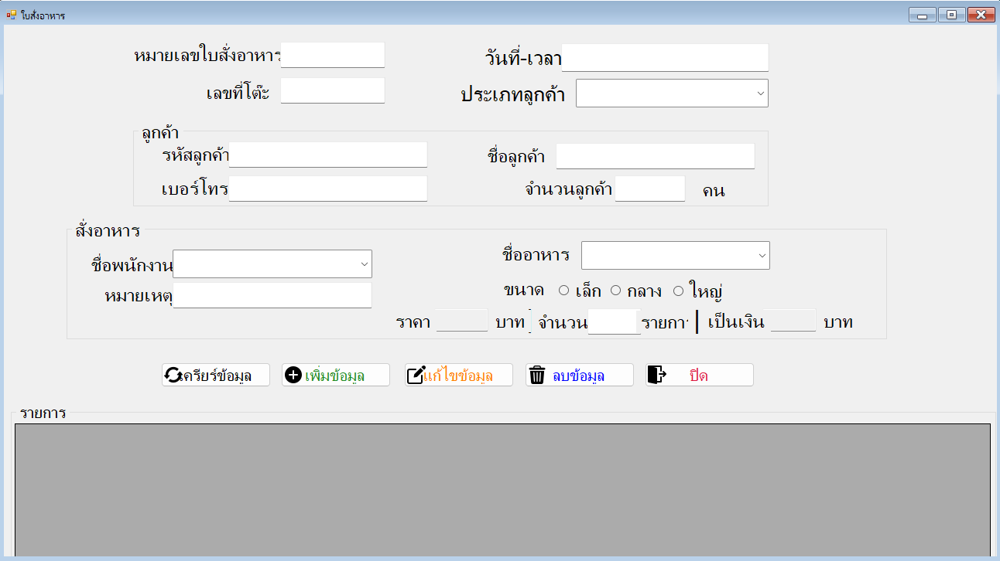
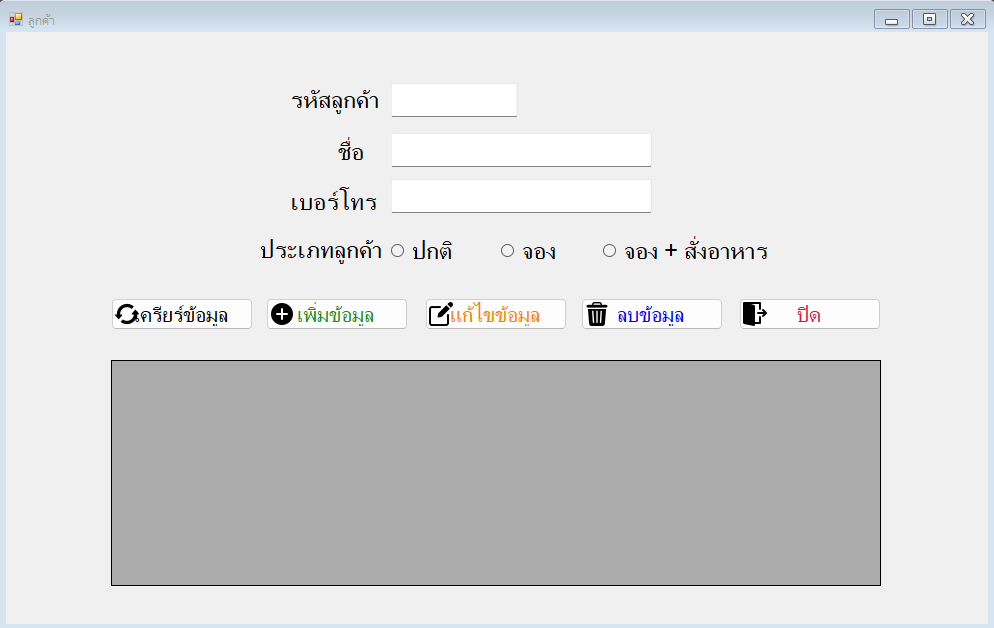
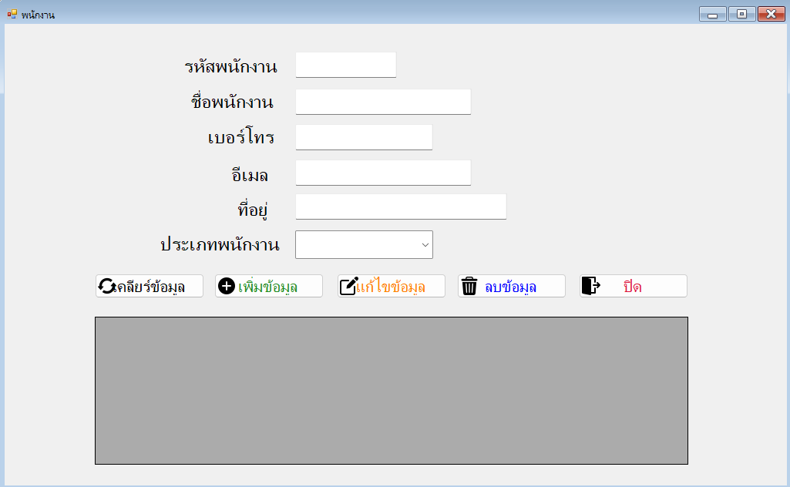
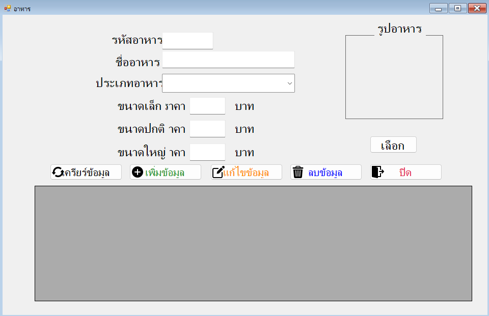
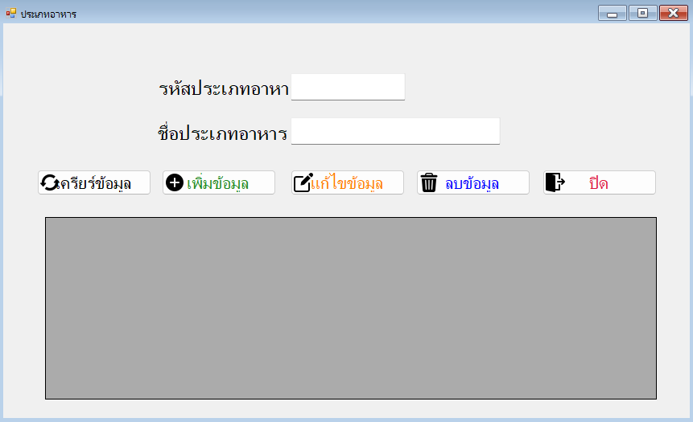
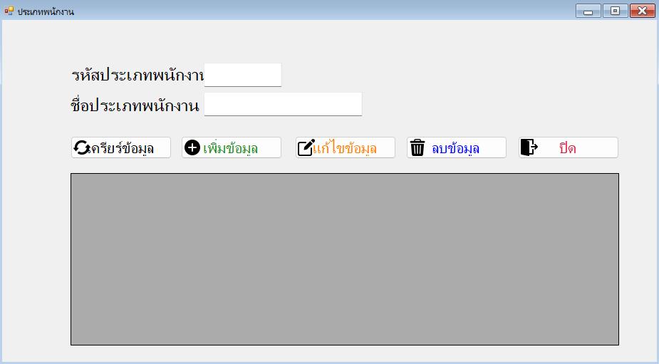

# C# Restaurant-System
Mini Project : C# Database System
My Group Work With My Friends.
* Arthit LungYa
* Raming Chaloemsuk
* Natthadanai Wongsa
### <ins> Order </ins> 

### <ins> Customer </ins> 

### <ins> Employee </ins> 

### <ins> Food </ins> 

### <ins> Food Type </ins> 

### <ins> Employee Type </ins> 

